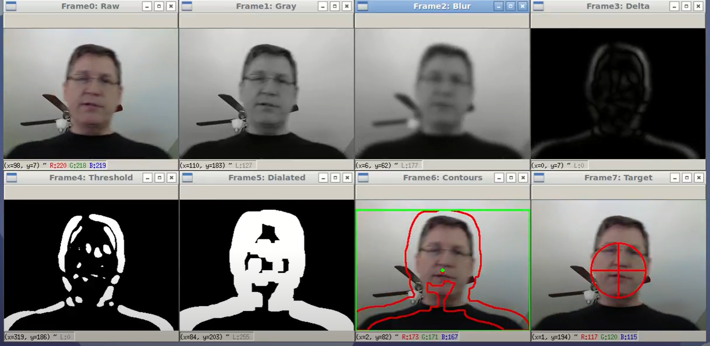

# Motion Detection
detect motion in the video by computing difference between frames using Python3 and OpenCV. A demonstration video will be generated in this directory.    
The video tutorial can be seen in [here](https://www.youtube.com/watch?v=BDt0-F3PL8U&t=34s).

## Snapshot


## Run
```shell
python motion_detection.py
```

Camera input or video file can be accepted as input. Only need to change the parameter
```python
camera = cv2.VideoCapture(0) # camera input
camera = cv2.VideoCapture("example.mp4") # video clip
```